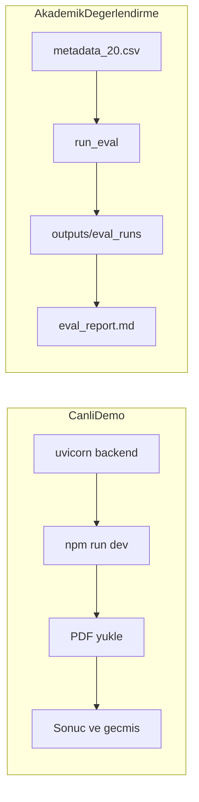

# QualiFlow

Graduation-project research prototype of a **quality-aware hybrid CoA verification system** for industrial Certificates of Analysis and Mill Test Certificates.

The system is not a productised SaaS. It is an academically scoped prototype that combines:

- a lightweight **document profiler** that classifies each PDF as `digital_clean`, `scan_clean`, `noisy_scan`, or `severe_scan`;
- an **explicit single-path router** that picks exactly one extraction strategy per document (no parallel OCR, no multi-agent arbitration);
- a **multimodal extraction path** (Anthropic Claude) that runs two stages — metadata, then line items — with deterministic tool-use schemas;
- **deterministic validation** against known steel-grade specs and suspicious-numeric bands;
- an auditable **review policy** that emits structured reason tokens for every flagged document while treating document quality as diagnostic metadata rather than a standalone blocker;
- a reproducible **dataset workflow** (discover, profile, manifest, gold candidates, batch extraction, evaluation) designed for ~100 PDFs.

Tesseract is kept strictly offline as a legacy cell-level OCR utility; it is never imported by the runtime.

---

## Sunum için Hızlı Başlatma

### Canlı demo (web arayüzü)

```bash
# Terminal 1 — backend
python -m venv .venv
.venv\Scripts\activate
pip install -r requirements.txt
uvicorn app.main:app --host 127.0.0.1 --port 8000 --reload

# Terminal 2 — frontend
cd frontend
npm install
copy .env.example .env
npm run dev
```

Tarayıcı: `http://127.0.0.1:5173`

**Demo akışı:** Kayıt ol → Giriş yap → PDF yükle → Sonuçları incele → Geçmiş → Detay sayfası → Kaynak PDF indir.

### Akademik değerlendirme (hazır sonuçlar)

20 belgelik gold set değerlendirmesi commit edilmiştir:

- Rapor: [`outputs/eval_runs/final20/eval_report.md`](outputs/eval_runs/final20/eval_report.md)
- Metrikler: [`outputs/eval_runs/final20/metrics_summary.csv`](outputs/eval_runs/final20/metrics_summary.csv)
- Gold annotations: [`data/gold/ground_truth/`](data/gold/ground_truth/) (20 JSON dosyası)
- Metadata index: [`data/gold/metadata_20.csv`](data/gold/metadata_20.csv)



---

## Akademik Bağlam

### Tez katkısı

| Bileşen | Dosya | Katkı |
| --- | --- | --- |
| Document profiler | `app/services/document_profiler.py` | Kalite sınıfına göre belge karakterizasyonu |
| Extraction router | `app/services/extraction_router.py` | Tek yol seçimi — maliyet ve doğruluk dengesi |
| Deterministik validasyon | `app/services/validator.py` | Çelik grade spec'lerine karşı uyumluluk |
| Review policy | `app/services/review_policy.py` | Yapılandırılmış, denetlenebilir review reason token'ları |

**Sade mimari özeti (Word):** [docs/QualiFlow_Mimari_Genel_Bakis.docx](docs/QualiFlow_Mimari_Genel_Bakis.docx) · [Markdown](docs/QualiFlow_Mimari_Genel_Bakis.md)

Detaylı mimari: [docs/runtime_architecture.md](docs/runtime_architecture.md)

Pilot çalışma durumu: [docs/pilot_study_status.md](docs/pilot_study_status.md)

Jüri özeti: [docs/jury_architecture_summary.md](docs/jury_architecture_summary.md)

### Gold set

- **20 Mill Test Certificate** PDF, dengeli kalite dağılımı
- Ground truth: `data/gold/ground_truth/doc001.json` … `doc020.json`
- Metadata index: `data/gold/metadata_20.csv`

---

## 1. Runtime architecture

```
upload PDF
   │
   ▼
document profiler          (app/services/document_profiler.py)
   │  quality_class in {digital_clean, scan_clean, noisy_scan, severe_scan}
   ▼
extraction router          (app/services/extraction_router.py)
   │  exactly one route in {native_multimodal, rendered_multimodal, preprocessed_multimodal}
   ▼
preprocess_pdf(route=…)    (app/services/preprocessing.py)
   │  per-page rasterisation + route-driven variant stack
   ▼
run_multi_stage_extraction (app/services/extraction_pipeline.py)
   │  Stage A metadata → Stage B item-centric line items (Claude tool use)
   │  row-shape normalization collapses vertical mechanical-property tables
   ▼
validate_document          (app/services/validator.py)
   │  grade-aware compliance + suspicious numerics + heat-pattern checks
   ▼
normalize_confidence       (app/services/confidence.py)
   │  combines raw model confidence with quality + completeness signals
   ▼
apply_review_policy        (app/services/review_policy.py)
   │  deterministic structured reason tokens (quality alone is not a gate)
   ▼
persist + respond with UniversalDocumentExtraction
```

See [docs/runtime_architecture.md](docs/runtime_architecture.md) for the profiler heuristics, the router decision table, and the full review-token catalogue.

The public API contract (`POST /api/v1/extract` and the `UniversalDocumentExtraction` schema) is unchanged by Phase 2. The route/profile/review data is stored in the internal `preprocessing_meta` so downstream tooling can inspect it without breaking the outward contract.

---

## 2. Setup

```bash
python -m venv .venv
.venv\Scripts\activate
pip install -r requirements.txt
```

> **Not:** Tek bağımlılık kaynağı kök `requirements.txt` dosyasıdır.

### Environment loading

The config module (`app/config.py`) loads `.env` files in this priority order:

1. **Repo-root `.env`** — the normal location; values here win.
2. **`docs/.env`** — fallback used during development when the repo-root file is absent or has a stale key. Neither file is committed (both are gitignored).
3. **Process environment** — values already in the shell always win over any file.

To validate your Anthropic key without printing it:

```bash
python -m scripts.check_anthropic_auth
# Expected:   OK: Anthropic auth succeeded. input_tokens=8 ...
```

### Dataset root

The batch workflow expects a folder of Mill Test Certificate PDFs. The path can come from either:

- `--dataset-root "C:\path\to\pdfs"` CLI flag, or
- `QUALIFLOW_DATASET_ROOT` environment variable.

If neither is provided the scripts fall back to `C:\Users\DELL\Downloads\Mill Test CertificateS\Mill Test CertificateS` (the repository's conventional development location).

---

## 3. Run backend

```bash
uvicorn app.main:app --host 127.0.0.1 --port 8000 --reload
```

Endpoints:
- `POST /api/v1/auth/register`
- `POST /api/v1/auth/login`
- `GET  /api/v1/auth/me`
- `POST /api/v1/extract`
- `GET  /api/v1/analyses`
- `GET  /api/v1/analyses/{analysis_id}`
- `GET  /api/v1/documents/{document_id}/download`
- `GET  /health`

---

## 4. Run frontend

```bash
cd frontend
npm install
copy .env.example .env
npm run dev
```

Frontend URL: `http://127.0.0.1:5173`

API base URL (`.env`): `VITE_API_BASE_URL=http://127.0.0.1:8000`

---

## 5. Dataset workflow (Phase 2)

See [docs/dataset_workflow.md](docs/dataset_workflow.md) for the detailed schema and folder layout. Short version:

```bash
# 1) discover all PDFs under the dataset root
python -m scripts.discover_documents

# 2) profile every PDF (no API calls — purely deterministic)
python -m scripts.profile_dataset

# 3) build the canonical manifest (adds bucketing fields)
python -m scripts.build_manifest

# 4) select a balanced 20-document gold candidate set
python -m scripts.select_gold_candidates --n 20

# 5) live batch extraction over the candidate subset (Mode D — routed hybrid)
python -m scripts.run_batch_extraction --subset data/gold_candidates/gold_candidates_manifest.jsonl --mode D

# Cost-limited smoke verification over exactly two PDFs
$env:QUALIFLOW_MAX_LIVE_DOCS='2'
$env:QUALIFLOW_BUDGET_USD='0.25'
python -m scripts.run_batch_extraction --subset data/two_pdf_manifest.jsonl --mode D --inter-doc-sleep-s 0

# 6) build the human-review pack (PREANNOTATED — NOT VERIFIED)
python -m scripts.build_prefill_pack --run-dir data/batch_runs/<timestamp>

# 7) generate predictions and evaluate the 20-document gold set
python -m scripts.run_eval \
    --metadata data/gold/metadata_20.csv \
    --documents-root "C:\path\to\pdfs" \
    --predictions outputs/predictions

# Or evaluate existing predictions only
python -m scripts.evaluate_outputs \
    --metadata data/gold/metadata_20.csv \
    --predictions outputs/predictions \
    --out outputs/eval_runs/manual_run
```

> **Deprecated:** `scripts/generate_reviewer_pack.py` — use `scripts/build_prefill_pack.py` instead.

Folder layout:

```
data/
├── manifests/
│   ├── documents_discovery.{jsonl,csv}
│   ├── documents_manifest.{jsonl,csv}
│   ├── profile_summary.csv
│   └── manifest.{jsonl,csv}
├── gold/
│   ├── metadata_20.csv
│   ├── metadata.csv          # backward-compatible copy
│   └── ground_truth/         # doc001.json … doc020.json
├── gold_candidates/
│   ├── gold_candidates_manifest.{jsonl,csv}
│   ├── gold_candidates_prefill.jsonl
│   └── annotation_sheet.csv  # PREANNOTATED — NOT VERIFIED
├── gold_verified/
│   └── (optional) annotations.{jsonl,csv}
└── batch_runs/<timestamp>/
    ├── per_document/<document_id>.json
    ├── summary.csv
    ├── summary.json
    ├── errors.jsonl
    ├── usage.csv
    └── config.json

outputs/
├── predictions/<doc_id>.json
└── eval_runs/<timestamp>/
    ├── metrics_summary.csv
    ├── metrics_by_field.csv
    ├── metrics_by_quality_bucket.csv
    ├── failure_cases.csv
    ├── metrics.json
    └── eval_report.md
```

### Experiment modes

Extraction modes are selected on **`run_batch_extraction`**. Evaluation (`run_eval` / `evaluate_outputs`) is mode-agnostic — point it at the prediction JSON directory produced by each batch run.

| Mode | Name | How to run | Notes |
| --- | --- | --- | --- |
| A | `legacy_ocr_offline_baseline` | — | **SKIPPED.** The existing Tesseract utility is cell-level OCR, not an end-to-end extractor. |
| B | `multimodal_direct_no_routing` | `python -m scripts.run_batch_extraction --mode B --subset …` | Bypasses the profiler/router. |
| C | `multimodal_preprocessed_fixed` | `python -m scripts.run_batch_extraction --mode C --subset …` | Always uses the full denoise/sharpen stack. |
| D | `routed_hybrid_proposed` | `python -m scripts.run_batch_extraction --mode D --subset …` (default) | The proposed thesis architecture. |

### What remains manual

- **Verified gold.** The preannotated pack is a model-generated proposal; treating it as truth would leak model bias into the evaluation. A human must edit `annotation_sheet.csv`, move accepted rows into `data/gold_verified/annotations.(jsonl|csv)`, and then re-run `scripts.load_gold` + `scripts.run_eval`.
- **Full 100-document live extraction.** The runner supports it, but live runs are intentionally restricted to the 20-document balanced subset during the thesis phase to keep API cost and rate-limit exposure predictable.

---

## 6. Persistence locations

- Database: `./data/qualiflow.db` (SQLite by default, override with `DATABASE_URL`)
- Uploaded PDFs: `./data/storage/pdfs`
- Preprocessing / table artifacts: `./data/storage/artifacts/<sha256>/`
- Extraction smoke-test outputs: `./data/outputs/`
- Dataset manifests / batch runs: see the tree above.
- Evaluation outputs: `outputs/eval_runs/`

---

## 7. Bundled evaluation scripts

### HTTP extraction smoke test (requires backend running)

```bash
python -m scripts.evaluate_extraction
```

Summarises rows, confidence, missing yield counts, and suspicious numeric bands per document — useful for eyeballing a live backend.

### OCR backend probe (legacy, offline only)

```bash
python -m scripts.check_ocr_backend  # optional
```

Runs Tesseract-based OCR against saved Stage 4 cell crops. **Not** part of the runtime. It remains in the repository only for reproducibility of earlier OCR experiments; installing Tesseract is optional.

### Batch + eval harness

```bash
python -m scripts.run_batch_extraction --help
python -m scripts.run_eval --help
python -m scripts.evaluate_outputs --help
python -m scripts.export_eval_summary --eval-root outputs/eval_runs
```

---

## 8. Live-execution status (as of 2026-05-11)

The latest checked live evidence is the cost-limited smoke sequence over
`doc001.pdf` and `doc002.pdf`. The combined two-PDF run
`data/batch_runs/plan_step6_two_pdfs_final` confirmed `doc002` auto-accepts.
The follow-up targeted run `data/batch_runs/plan_step6_doc001_final` confirmed
the remaining `doc001` row-shape/heat issue is fixed.

| Step | Status | Notes |
| --- | --- | --- |
| Two-PDF manifest | **DONE** | `data/two_pdf_manifest.jsonl` limits live verification to `doc001` and `doc002`. |
| Cost-limited Mode D run | **DONE** | `2 / 2` docs processed via `preprocessed_multimodal`; no other PDFs were called. |
| Batch reporting contract | **UPDATED** | `summary.csv` and `usage.csv` are expected to carry structured reasons and token usage on new runs. |
| Row-shape normalization | **UPDATED** | Vertical mechanical-property rows can be collapsed into one item-centric product row. |
| Grade/spec coverage | **UPDATED** | Observed `SG2` and `321/321H` aliases are covered by deterministic validation rules. |
| Full 20-doc benchmark | **PENDING** | Should be run only after the two-PDF smoke set passes with acceptable review reasons. |
| Verified gold | **PENDING** | Ground-truth files exist, but final thesis metrics should be regenerated from verified results. |

### Current Two-PDF Snapshot

| metric | value | notes |
| --- | --- | --- |
| doc001_latest_status | COMPLETED | `data/batch_runs/plan_step6_doc001_final`; `1 / 1` item, no missing critical fields |
| doc001_latest_review_required | false | Confidence `0.91`, `review_rate=0.0` in the targeted run |
| doc002_latest_status | COMPLETED | `data/batch_runs/plan_step6_two_pdfs_final`; extraction complete and auto-accepted |
| batch_errors | 0 | Runtime completed successfully in the latest smoke runs |
| latest_doc001_estimated_cost_usd | 0.049527 | From `usage.csv` |

> [!NOTE]
> Historical optimistic 20-document metrics were removed from this README
> because the current evidence showed unresolved extraction and review-policy
> issues. Regenerate full metrics only after the two-PDF smoke set is clean.
> Committed eval results for the 20-doc gold set are in `outputs/eval_runs/final20/`.

---

## 9. Tests

```bash
python -m pytest tests/ -q
```

Phase 2 adds `tests/test_document_profiler.py`, `tests/test_extraction_router.py`, `tests/test_review_policy.py`, `tests/test_evaluation_metrics.py`, and `tests/test_manifest_builder.py`. All existing tests remain green.

---

## 10. Internal modules (reference)

- **Document profiler** — `app/services/document_profiler.py` — text-layer + blur/noise → quality class. See [docs/runtime_architecture.md](docs/runtime_architecture.md).
- **Extraction router** — `app/services/extraction_router.py` — picks exactly one route; supports `force_route` for experiment modes.
- **Review policy** — `app/services/review_policy.py` — structured review reason tokens.
- **Adaptive preprocessing** — `app/services/preprocessing.py` + `app/services/preprocessing_strategy.py` — rasterisation, variant stack, route-aware selection. Developer notes in [docs/preprocessing_strategy.md](docs/preprocessing_strategy.md).
- **Multimodal extraction pipeline** — `app/services/extraction_pipeline.py` — Stage A / Stage B Claude tool-use, normalisation, validation, confidence, review policy.
- **Row-shape normalizer** — `app/services/row_shape_normalizer.py` — collapses vertical mechanical-property tables and backfills single-item metadata context.
- **Validation** — `app/services/validator.py` — `MATERIAL_SPECS` compliance, suspicious numeric bands, heat-pattern consistency.
- **Confidence normalisation** — `app/services/confidence.py` — combines validator output, missing critical fields, blur/noise, and review threshold.
- **Field registry** — `app/domain/field_mapping_registry.py` — canonical header normalisation. Developer notes in [docs/domain_schema.md](docs/domain_schema.md).
- **Table geometry parser** — `app/services/table_parser.py`. Developer notes in [docs/table_parsing.md](docs/table_parsing.md).
- **Legacy OCR (offline)** — `app/services/ocr_service.py` — isolated Tesseract probe; not imported by the runtime.
